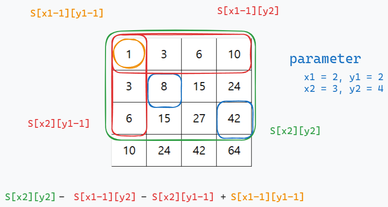

#  [11660] 구간합
> [2024-06-26](https://www.acmicpc.net/problem/11660)

## Question
#### 문제
``` 
N×N개의 수가 N×N 크기의 표에 채워져 있다. 
(x1, y1)부터 (x2, y2)까지 합을 구하는 프로그램을 작성하시오. (x, y)는 x행 y열을 의미한다.

아래 표에서 (2, 2)부터 (3, 4)까지 합을 구하면 3+4+5+4+5+6 = 27이고, 
(4, 4)부터 (4, 4)까지 합을 구하면 7이다.

표에 채워져 있는 수와 합을 구하는 연산이 주어졌을 때, 이를 처리하는 프로그램을 작성하시오.
```

|   | `0` | `1` | `2` | `3` |
|-----|-----|-----|-----|-----|
| `0` | 1   | 2   | 3   | 4   |
| `1` | 2   | 3   | 4   | 5   |
| `2` | 3   | 4   | 5   | 6   |
| `3` | 4   | 5   | 6   | 7   |

#### 입력
``` 
첫째 줄에 표의 크기 N과 합을 구해야 하는 횟수 M이 주어진다. 
(1 ≤ N ≤ 1024, 1 ≤ M ≤ 100,000) 둘째 줄부터 N개의 줄에는 표에 채워져 있는 수가 1행부터 차례대로 주어진다.
다음 M개의 줄에는 네 개의 정수 x1, y1, x2, y2 가 주어지며, 
(x1, y1)부터 (x2, y2)의 합을 구해 출력해야 한다. 
 표에 채워져 있는 수는 1,000보다 작거나 같은 자연수이다. (x1 ≤ x2, y1 ≤ y2)
```
#### 출력
``` 
총 M줄에 걸쳐 (x1, y1)부터 (x2, y2)까지 합을 구해 출력한다.
```

### Tag
`누적합`, `DP`

--- 

## Answer `(./Main.java)`

> [!tip]
> 팁, 중요한 점

#### 2차원 배열 합 배열 만들기
1. `x-1` 인덱스를 기준으로 이전 합배열 값을 구한다
2. `y-1` 인덱스를 기준으로 이전 합배열 값을 구한다
3. 원하는 인덱스 `(x,y)` 의 그냥 `값` 을 구한다.
4. `1`,`2`,`3` 을 모두 더한 후 겹치는 `(x-1, y-1)` 의 합배열 값을 뺀다

#### 요구범위 내 합 구하는방법
1. 두번째 인덱스까지의 합배열을 구한다
2. 첫 인덱스와 두번째 인덱스를 기준으로 제거할 값을 구하고 뺀다
3. `2` 와 같이 할 경우 겹쳐서 뺀 부분이 발생하므로 해당 부분 더한다
<br>




| 메모리(kb) | 시간  (ms) | 시간복잡도    |
|---------|----------|----------|
| 121592   | 800       | $O(n^2)$ |
