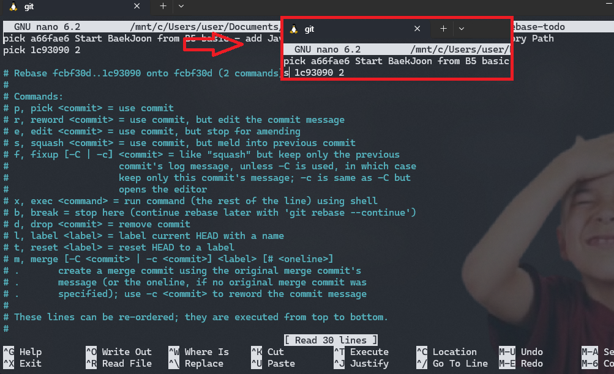
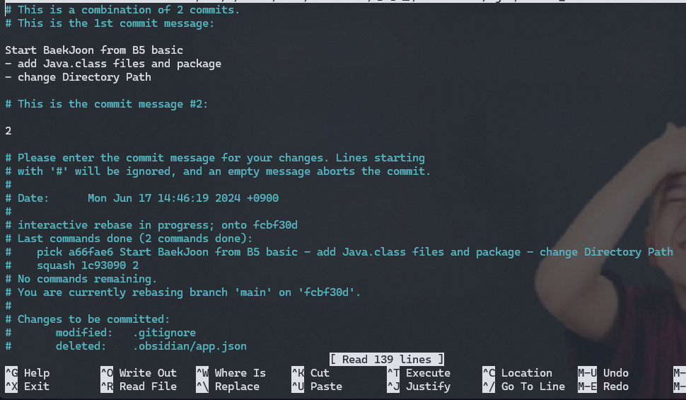

> 지저분한 커밋 내용 여러개 하나로 깔끔하게 합친 후 커밋하기
> github 에도 history 는 하나만 남기고..

# rebase & squash


#### 현재 커밋 기록 먼저 확인
```bash
git log --all --decorate --graph --oneline

```
#### 합칠 commit들 선택 후 rebase
```bash
git rebase -i HEAD~4
```
합치고 싶은 커밋 개수 (Head 로부터 몇개 없앨건지)
=> 2개면 Head 와 그 전 커밋 합침

#### squash

1. 아래와 같이 뜬 화면에서 맨 위 커밋만 pick 으로 남기고
- 나머지는 s(squash) 로 변경 처리 


변경완료 후 `^X` `Y` `Enter`

2. 저장하면 rebase 후 커밋메시지 수정창이 뜸
- 여기서 원하는 커밋메시지로 수정 (#주석 제외 전부 커밋메시지로 남게됨)

### 다했으면 원격에 push

`-f` 강제 옵션 붙여 주지 않으면 오류발생 (로컬과 원격의 history 가 달라졋기에)
```bash
git push origin main -f
```

> [!tip]
> 되돌리기

### rebase  중 오류났을 경우 되돌리기
```bash 
git rebase --abort
```

### 가장 최근 커밋메시지만 변경하고 싶을때 
푸시하기 전에만 가능함
```bash 
git commit --amend
```